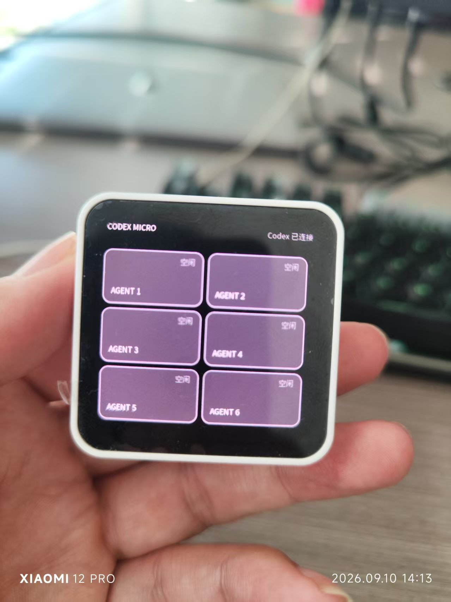
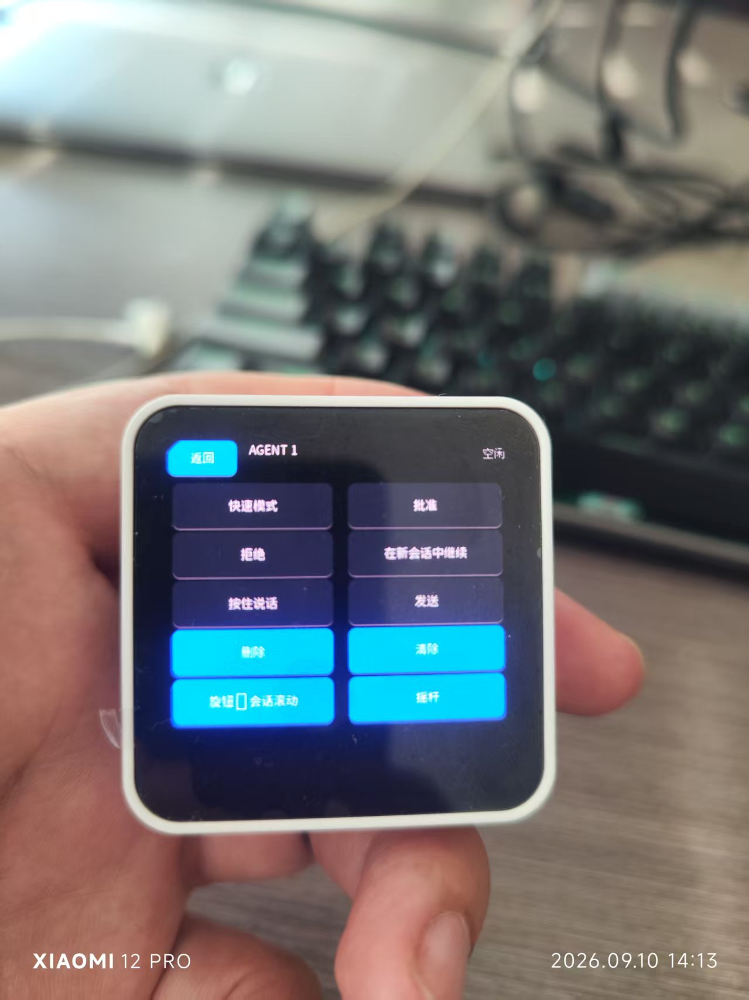
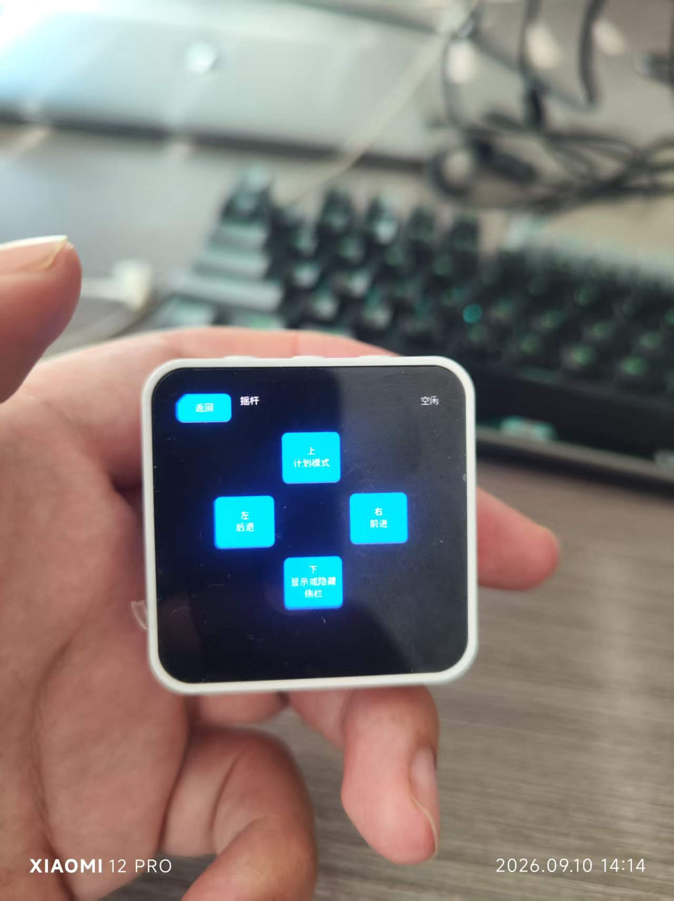
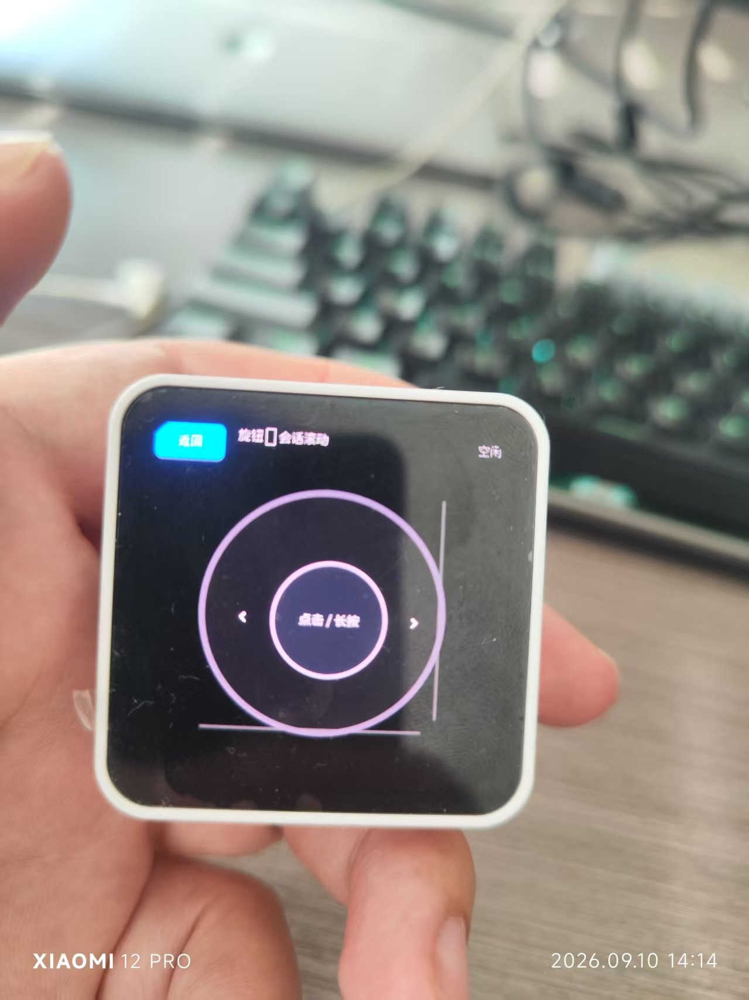
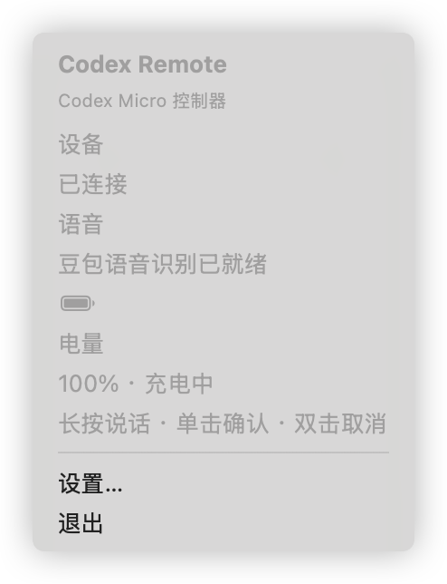

# Codex Remote

Codex Remote 由 macOS App 和 ESP32-S3 设备组成。设备通过 480×480 AMOLED 屏幕显示 Codex Agent 状态，并提供触摸、实体按键、旋钮、摇杆和语音输入。Mac App 负责伴随 BLE 通道、Codex Micro 布局同步、语音识别和文本注入。

仓库也提供 Windows x64 伴随客户端，安装方式见下文。

## 界面预览

以下为设备实拍与 macOS 客户端截图。设备上的 Command 文案、旋钮模式及摇杆方向操作随当前配置同步。

| Agent 首页 | 操作页 |
| --- | --- |
|  |  |
| 2×3 卡片展示六个 Agent 的状态。 | 集中显示当前 Agent 的快捷操作。 |

| 摇杆页 | 旋钮页 |
| --- | --- |
|  |  |
| 显示四个方向对应的操作。 | 外圈支持左右操作，中心支持点击与长按。 |

### macOS 菜单栏

显示设备连接、语音识别就绪状态、电量与充电状态，并提供设置入口。



## 安装指南

### 下载发布包

前往 [GitHub Releases](https://github.com/ninestep/codex_esp32/releases/latest)，下载同一版本的客户端和固件。以下以 `v0.1.11` 为例，使用其他版本时替换文件名中的版本号。

| 文件 | 用途 |
| --- | --- |
| `CodexRemote-v0.1.11-macOS.dmg` | macOS 客户端 |
| `CodexRemote-v0.1.11-Windows-x64.zip` | Windows x64 客户端 |
| `CodexRemote-v0.1.11-ESP32S3-firmware.tar.gz` | ESP32-S3 固件、分区表及烧录参数 |
| `SHA256SUMS` | 发布包 SHA-256 校验值 |

下载后将文件的 SHA-256 与同版本 `SHA256SUMS` 对比。macOS 可执行 `shasum -a 256 <文件路径>`，Windows PowerShell 可执行 `Get-FileHash <文件路径> -Algorithm SHA256`。

### macOS 客户端

1. 准备 macOS 15 或更高版本，并打开蓝牙；使用 Codex Micro 增强模式时，还需要支持该设备的 ChatGPT Desktop。
2. 打开 DMG，将 `Codex Remote.app` 拖入 `Applications`。升级时先退出旧 App，并保留一份旧版本备份。
3. 从“应用程序”打开 Codex Remote。发布包使用 ad-hoc 签名，未经过 Apple 公证；若系统提示无法验证开发者，在确认下载来源和校验值后，按 [Apple 官方说明](https://support.apple.com/zh-cn/102445)进入“系统设置 → 隐私与安全性 → 仍要打开”。
4. 按提示允许蓝牙访问。设备上电后，在 App 设置的“设备连接”中检查连接、电量和充电状态；App 会自动查找并重新连接附近设备。
5. 需要语音输入时，在设置的“语音识别”中点击“登录豆包…”，完成网页登录，再点击“辅助功能权限”旁的“授权…”。在系统设置中允许 Codex Remote 后，必要时退出并从“应用程序”重新打开。
6. 将光标放入目标输入框，长按设备实体键说话，松开后确认最终文字完整输入；再检查单击 Enter、双击 Escape 和 Agent 卡片操作。

当前语音链路使用设备麦克风和豆包 Web 识别，无需安装豆包输入法、BlackHole 或虚拟麦克风。直接使用发布包也无需安装 Swift 或 ESP-IDF。

### Windows 客户端

1. 准备 Windows 10 22H2（build 19045）或更高版本的 x64 系统，以及支持 BLE 的蓝牙适配器。
2. 安装 [.NET 10 Desktop Runtime（Windows x64）](https://dotnet.microsoft.com/zh-cn/download/dotnet/10.0)。发布包依赖系统运行时，需选择 Desktop Runtime。
3. 将 Windows ZIP 完整解压到固定目录，运行 `CodexRemote.WindowsApp.exe`；保留同目录的 DLL 和其他资源文件。
4. 豆包登录界面使用 WebView2；若提示缺少运行时，安装 [Microsoft Edge WebView2 Runtime](https://developer.microsoft.com/microsoft-edge/webview2/)。打开系统蓝牙后，在客户端完成设备连接与豆包登录。
5. 在目标输入框检查语音最终文本和按键输入。Windows 发布流程包含构建与自动化测试，实际 BLE、登录和文本注入仍需在目标电脑验收。

Windows 开发说明见 [windows/README.md](windows/README.md)。

### ESP32-S3 固件

固件适用于 **Waveshare ESP32-S3-Touch-AMOLED-2.16（16 MB Flash）**。使用可传输数据的 USB 线连接设备，并退出占用串口的监视器。`v0.1.11` 的充电配置为 4.2 V、恒流上限 500 mA；接入电池前确认其规格允许该充电配置。

先安装 Python 3，再安装 [esptool 5.x](https://docs.espressif.com/projects/esptool/en/latest/esp32s3/esptool/basic-commands.html)，无需为预编译固件安装完整 ESP-IDF。下面是 macOS/Linux 终端示例：

```bash
python3 -m venv .venv-esptool
source .venv-esptool/bin/activate
python -m pip install 'esptool>=5,<6'

mkdir codex-remote-firmware
tar -xzf CodexRemote-v0.1.11-ESP32S3-firmware.tar.gz -C codex-remote-firmware
cd codex-remote-firmware
python -m serial.tools.list_ports
```

Windows 可使用 `py -m venv .venv-esptool` 创建环境，并在 PowerShell 中执行 `.\.venv-esptool\Scripts\Activate.ps1` 激活，再使用上述 `python`、`mkdir`、`tar` 和 `cd` 命令。若系统策略不允许激活脚本，可用该环境中 `python.exe` 的绝对路径替代 `python`。

将下面的 `PORT` 替换为刚枚举的实际串口，例如 macOS 的 `/dev/cu.usbmodem...`、Linux 的 `/dev/ttyACM0` 或 Windows 的 `COM3`。在解压目录执行；若使用其他版本，先核对包内 `flasher_args.json` 的地址及 Flash 参数。

```bash
python -m esptool --chip esp32s3 --port PORT --baud 460800 write-flash \
  --flash-mode dio --flash-size 16MB --flash-freq 80m \
  0x0 bootloader/bootloader.bin \
  0x8000 partition_table/partition-table.bin \
  0x10000 codex_remote.bin
```

PowerShell 中将烧录命令写成一行执行。等待写入和哈希校验成功，设备复位后检查屏幕及 BLE 连接。若无法连接，按板卡说明进入下载模式，重新枚举串口后再试。常规升级只写上述三个镜像，无需全片擦除；全片擦除会清除配对及离线日志等数据。已有其他固件时，旧数据分区可能导致离线日志不可用，应先备份并按[离线日志说明](docs/verification/2026-09-07-offline-power-log.md)处理。

## 当前工作模式

### Codex Micro 增强模式

ESP32 通过原生 HOGP/HID 接入 ChatGPT Desktop：

- 首页以 2×3 卡片显示 6 个 Agent，无需滚动。
- Agent 状态支持空闲、正在处理、已完成、需要输入、错误和离线。
- 点击 Agent 后进入操作页，显示当前六个 Command、删除、清除、旋钮和摇杆入口。
- 六个 Command 直接发送 `ACT06`、`ACT07`、`ACT08`、`ACT09`、`ACT10`、`ACT12`。
- 删除发送 Backspace；清除发送 Command+A 后再发送 Backspace。
- 旋钮支持左右旋转、中心点击和长按；摇杆支持上、右、下、左。
- 实体键长按开始语音输入，单击发送 Enter，双击发送 Escape。
- Agent 状态变化会点亮屏幕；已完成和需要输入使用不同提示音。

Mac App 读取 `~/.codex/config.toml` 中的 `[desktop.codex-micro-layout]`，将六个 Command、`encoderMode` 和 `analogStick` 四个方向的当前设置转换为显示文案，再通过伴随 BLE 通道同步到设备。设备操作仍通过原生 HID 发送；Mac App 只负责布局显示和语音链路。

### Mac 会话模式

仓库仍保留基于 Codex hooks、Ghostty 映射和 BLE 会话同步的 Mac 会话模式。该模式最多显示 8 个会话，因此列表保留垂直滚动。Codex Micro 的 6 卡首页固定在顶部并关闭滚动。

## 语音输入

语音链路不依赖豆包输入法、虚拟麦克风或 BlackHole：

1. ESP32 采集麦克风音频并编码为 ADPCM。
2. 伴随 BLE 通道将音频帧发送给 Mac App。
3. Mac App 使用已登录的豆包 Web 会话进行流式识别。
4. 松开实体键后，App 等待最终结果并将完整文本输入当前焦点。

首次使用时，在 Mac App 中登录豆包，并授予辅助功能权限。BLE 音频到达、登录成功或出现权限提示都不等于语音链路验收完成；真机验收必须确认最终文字完整进入目标输入框。

## 项目结构

```text
macos/      SwiftPM 工程、SwiftUI App、macOS 集成、测试和 BLE fixtures
firmware/   ESP-IDF 固件、可复用组件、设备入口和 C17 host tests
windows/    Windows x64 伴随客户端与测试
docs/       架构设计、实施计划、验证记录和设备启用手册
```

跨端 BLE v1.4 协议由 Swift 与 C 共同实现。修改消息类型、布局、UUID、字段限制或能力位时，必须同步更新两端代码和 `macos/Fixtures/ble-v1/` 中的 golden fixtures。

## 源码开发环境

- macOS 15 或更高版本
- Swift 6.2 工具链
- ESP-IDF 5.5.x
- Waveshare ESP32-S3-Touch-AMOLED-2.16
- ChatGPT Desktop；Mac 会话模式还需要 Ghostty 和 Codex CLI

仓库构建不会自动安装 `/Applications/Codex Remote.app`、烧录设备、修改用户级 hooks，也不会代替系统权限授权。

## 构建与测试

在仓库根目录运行：

```bash
swift build --package-path macos --disable-sandbox
swift test --package-path macos --parallel --disable-sandbox

zsh firmware/test/host/run-tests.zsh all
zsh firmware/test/host/verify-golden-fixtures.zsh

# 先激活 ESP-IDF 环境
(cd firmware && idf.py build)
```

生成本机验证用 App：

```bash
zsh macos/Scripts/package-app.zsh release /tmp/codex-remote-build
```

脚本优先使用已配置的本机签名身份；CI 使用 ad-hoc 签名。测试构建不等于 Developer ID 签名、公证或第三方分发版本。

## 真机验收

自动化测试覆盖协议、状态机、布局解析、配置流程和构建。发布前仍需在真实设备上检查：

- 6 个 Agent 卡片、状态变化、20 秒详情页返回和唤醒逻辑。
- 六键、删除、清除、旋钮、摇杆及实体键操作。
- Mac App 自动重连及六键、旋钮、摇杆布局同步。
- 完整语音输入、最终文本、连续输入和失败恢复。
- 已完成与需要输入的提示音。

当前客户端安装以本文为准。[设备到位启用手册](docs/设备到位启用手册.md)保留旧版 Mac 会话模式的联调记录，其中 BlackHole、豆包快捷键及旧安装向导步骤不适用于当前 Codex Micro 语音链路。

## 提交与发布

提交前阅读 [Repository Guidelines](AGENTS.md)。提交信息采用 Conventional Commits，例如 `feat(firmware): 同步 Codex Micro 控件布局`。只提交当前任务相关文件，并记录实际测试和未覆盖的硬件风险。

推送 `v*` tag 会触发 GitHub Release workflow，构建 macOS DMG、Windows x64 ZIP、ESP32-S3 固件包和 checksums。只有 workflow 与 GitHub Release 均成功后，才能认定版本发布完成。

## 友情链接

- [linux.do](https://linux.do/u/80yan9/)

## License

本项目使用仓库根目录 [LICENSE](LICENSE) 中声明的许可证。
